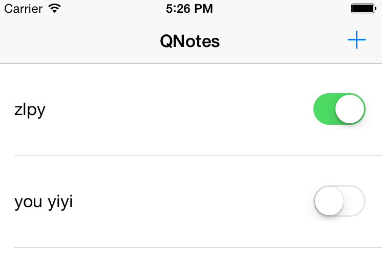

QNotes
===================
NSCoder NSCoding NSUserDefaults 保存数据到磁盘

向左滑动cell显示删除按钮，并删除相应的cell

**Core Code**

```ruby
editing_style: :delete

def on_cell_deleted
 #something you can do
end
```

RedPotion use ProMotion-2.3.1 (editing_style: :delete) not work, update ProMotion to 2.4.1 work well for [https://github.com/zhulinpinyu/redpotion](https://github.com/zhulinpinyu/redpotion)

**editing_style: :delete**


```ruby
accessory: {
  view: :switch, # UIView or :switch
  value: true, # whether it's "checked" or not
  action: :accessory_switched,
  arguments: { some_arg: true } # :value is passed in if a hash
}
```
